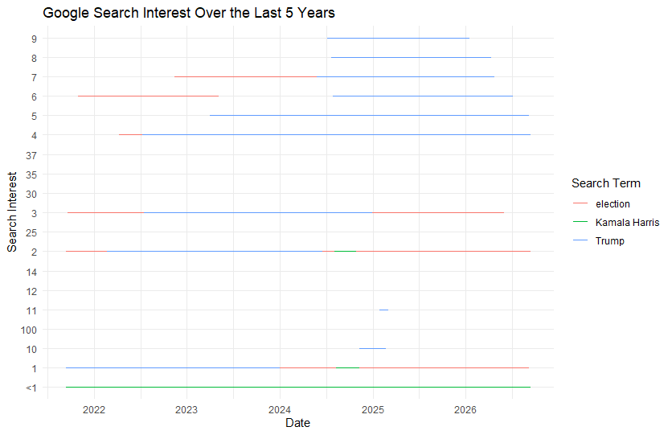
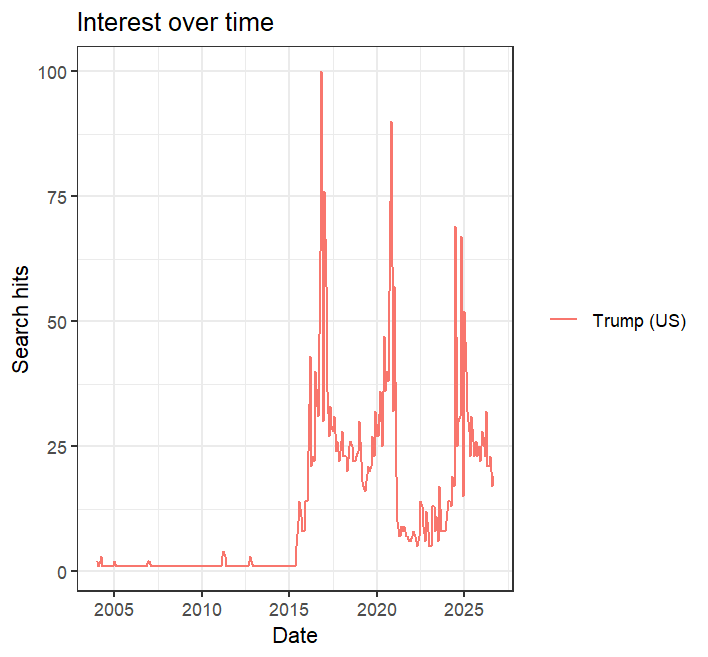
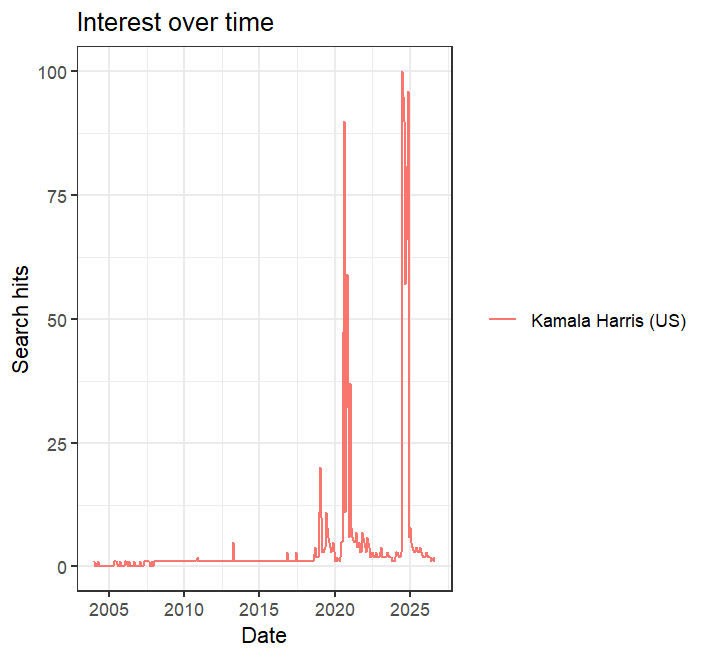

**Query Parameters**

| Parameter       | Value                          |
|-----------------|--------------------------------|
| Search Terms    | Trump, Kamala Harris, election |
| Geography       | US                             |
| Search Type     | Web search                     |
| Time Period     | Last 5 years                   |
| Category        | All categories                 |
| Interest filter | Interest only                  |

**Google Trends Results**

The graph shows Google search interests for Trump, Kamala Harris, and election over the last 5 years. Google Trends report related search interests rather than specfic number of searches.

```         
library(readr)
library(ggplot2)

# Read the Google Trends data
data <- read_csv("trump_harris_election.csv")

# Convert date to Date format
data$date <- as.Date(data$date)

# Create the plot ggplot(data, aes(x = date, y = hits, color = keyword)) + 
  geom_line() + 
  labs
    ( title = "Google Search Interest Over the Last 5 Years",
    x = "Date",
    y = "Search Interest",
    color = "Search Term"
  ) + 
  theme_minimal()
```



Interest Over Time

```         
TrumpHarrisElection <- gtrends(c("Trump", "Kamala Harris"),
                              onlyInterest = TRUE,
                              geo = "US",
                              gprop = "web",
                              time = "all", # last five years
                              category = 0)
the_df <- TrumpHarrisElection$interest_over_time
plot(TrumpHarrisElection)

# Cache the raw pull — the next call will not return the same numbers
write_csv(the_df, paste0("gtrends_us_5y_", Sys.Date(), ".csv"))
```

|                    |                     |
|:------------------:|---------------------|
|  |  |

**Questions**

The website instructions say Kamala Harris. The script searches Harris. Pull both and compare the series. Are they the same?

"Harris" and "Kamala" pulled different results. There was a peak for "Harris" in 2023 which was not there for "Kamala Harris". "Harris" is a broader search term that can refer to Kamala Harris as well as other people and places. A search term does not necessarily represent what the researcher is trying to measure. Using Harris as a search term can make include unrelated searches in the data.

Line the two series up. Are the numbers identical?

The numbers are not identical, most of the values change by +1 with most differences happening with Trump searches.

Reproducibility- the method is reproducible because of the listed code that was used and the times and dates the data was pulled. The results may not be precisely the same because Google Trends use sampled data and includes statistical noise.

Provenance- the R method records the query parameters in the resulting data and stores them in the CSV, but the settings used would have to be documented.

Scale- R is useful for a large amount of terms. R works better when you need 50 terms instead of 3 because you can put all the terms into a vector and automate the process.

Fragility- The fragility depends on Google Trends and any changes that happen. The R method works if Google Trends doesn't change, but it does. It can cause errors or change results. If the code produces an error, returns no data, or gives unexpected results, you would know something broke.

Run the same call twice, a few minutes apart. What changes?

If you run the same code a few minutes apart some values may change slightly. Because of Google Trends and how they use a sample of searches and include statistical noise, there may be a few fluctuations in the results. Google Trends numbers are not an exact measurement.
