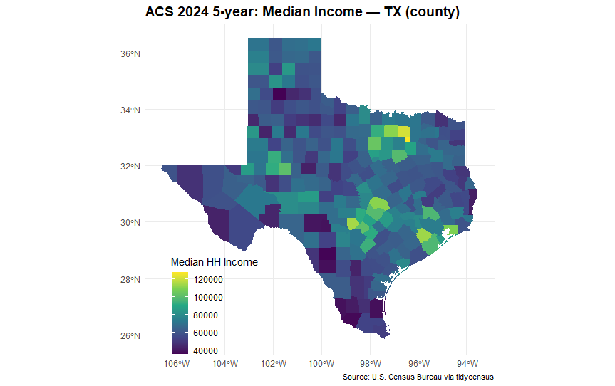
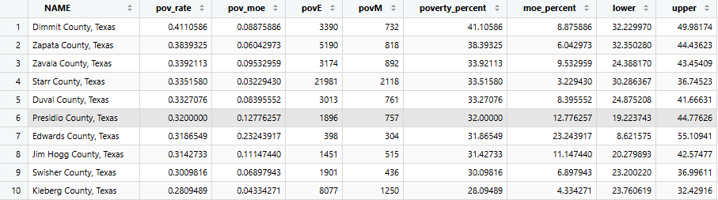
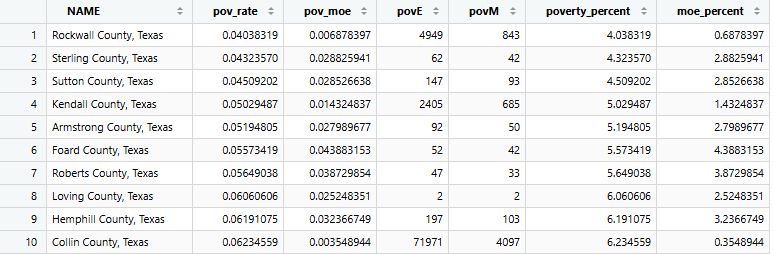

1.  Setup

    #Packages

    ```         
    library(tidycensus)
    library(tigris)
    library(sf)
    library(dplyr)
    library(tidyr)
    library(ggplot2)
    library(readr)
    ```

    ```         
    options(tigris_use_cache = TRUE)
    ```

The Census API key was installed separately in the console and is stored in .Renviron which is not included in this document.

```         
# The API key is installed once in the R console.
# census_api_key("YOUR_CENSUS_KEY", install = TRUE)
```

2.  Geography and Variables

    I used Texas counties as the geographical unit. I used median household income as the variable for the map and the poverty rate for the table. For the poverty variable, I used both the numbers below the poverty level and the total population of people in poverty to calculate a rate rather than using a count.

    ```         
    # Explore Census variables
    vars <- load_variables(2024, "acs5")

    vars |>
      dplyr::filter(grepl("^B19", name)) |>
      dplyr::slice_head(n = 10)
    # Parameters
    state_abbr <- "TX"
    geo_level <- "county"

    my_vars <- c(
      income = "B19013_001",      # Median household income
      pov = "B17001_002",         # People below poverty
      povden = "B17001_001"       # Poverty universe / denominator
    )

    year_acs <- 2024
    survey <- "acs5"
    ```

3.  Downloading Census Data

    ```         
    acs_wide <- get_acs(
      geography = geo_level,
      variables = my_vars,
      state = state_abbr,
      year = year_acs,
      survey = survey,
      geometry = TRUE,
      output = "wide"
    )
    ```

    The ACS data includes both estimates and margins of error. The margin of error stays because ACS estimates are based on a sample rather than a census population.

4.  Calculating Poverty Rate and Margin of Error

    ```         
    acs_wide <- acs_wide |>
      mutate(
        pov_rate = povE / povdenE,
        pov_moe = moe_prop(
          povE,
          povdenE,
          povM,
          povdenM
        )
      )
    ```

    The poverty rate is calculated by dividing the estimated number of people below the poverty level by the estimated population of impoverished people. The moe_prop() function calculates the margin of error and accounts for the uncertainty in both the total number of people in poverty and the number of people living below the poverty line.

5.  Map

    ```         
    ggplot(acs_wide) +
      geom_sf(aes(fill = incomeE), color = NA) +
      scale_fill_viridis_c(
        name = "Median HH Income",
        labels = scales::label_dollar()
      ) +
      labs(
        title = paste0(
          "ACS ", year_acs,
          " 5-year: Median Household Income — ",
          state_abbr,
          " (", geo_level, ")"
        ),
        caption = "Source: U.S. Census Bureau via tidycensus"
      ) +
      theme_minimal() +
      theme(
        text = element_text(family = "Palatino"),
        plot.title = element_text(size = 14, face = "bold"),
        plot.caption = element_text(size = 8),
        legend.position = "inside",
        legend.position.inside = c(0.2, 0.15)
      )
    ```

{fig-align="center"}

The map shows the median household income for each county in Texas. Darker and lighter areas represent the different estimated levels of median income.

6.  Top and Bottom 10 Counties by Poverty Rate

```         
top10 <- acs_wide |>
  st_drop_geometry() |>
  arrange(desc(pov_rate)) |>
  select(
    NAME,
    pov_rate,
    pov_moe,
    povE,
    povM
  ) |>
  slice_head(n = 10) |>
  mutate(
    poverty_rate = pov_rate * 100,
    margin_of_error = pov_moe * 100
  ) |>
  select(
    NAME,
    poverty_rate,
    margin_of_error,
    povE,
    povM
  )
```

```         
bottom10 <- acs_wide |>
  st_drop_geometry() |>
  arrange(pov_rate) |>
  select(
    NAME,
    pov_rate,
    pov_moe,
    povE,
    povM
  ) |>
  slice_head(n = 10) |>
  mutate(
    poverty_rate = pov_rate * 100,
    margin_of_error = pov_moe * 100
  ) |>
  select(
    NAME,
    poverty_rate,
    margin_of_error,
    povE,
    povM
  )
```

Top 10

{fig-align="center"}

Bottom 10

{fig-align="center"}

The tables shows the counties with the highest and lowest poverty rates. The margin of error is shown beside each estimate to show the uncertainty of the ACS estimates.

7.  Uncertainty Check

    ```         
    uncertainty <- acs_wide |>
      st_drop_geometry() |>
      mutate(
        poverty_rate = pov_rate * 100,
        margin_of_error = pov_moe * 100,
        lower = poverty_rate - margin_of_error,
        upper = poverty_rate + margin_of_error
      ) |>
      arrange(desc(poverty_rate)) |>
      select(
        NAME,
        poverty_rate,
        margin_of_error,
        lower,
        upper
      )
    ```

Using a 90% confidence interval, the poverty rate estimate and margin of error were calculated. Two counties can have different estimated poverty rates while their confidence intervals overlap. When confidence intervals overlap, the difference in the point estimates does not mean there is a clear difference in the poverty rates. The rankings have some uncertainty.

One pair of counties with overlapping intervals are Dimmit county and Zapata county. Dimmit county has an estimated poverty rate of 41.11% with a margin of 8.88%, which gives an interval of 32.23% to 49.98%. Zapata county has an estimated poverty rate of 38.39% with a margin of 6.04%, giving an interval of 32.35% to 44.44%. Because these intervals overlap, the difference between their estimated poverty rates should be interpreted lightly. Dimmit does have a higher point estimate but the overlapping intervals indicate that the estimates are not separated enough to treat the rankings as a difference in poverty rates.

8.  Methods Note

    I used Texas counties as the geographical unit and the 2024 American Community Survey 5 year estimates. I used median household income for the map and poverty variables for the table. The poverty variable is a count of people below the poverty line, so I divided it by the total population in the poverty universe which calculated the poverty rate. By retaining the ACS margins of error and using moe_prop(), I was able to manage uncertainty in the calculated poverty rates. The margin of error is important because ACS estimates are often based on a sample and contains sample uncertainty. Counties with similar estimated poverty rates may have overlapping confidence intervals and show how their rankings should be interpreted with caution rather than taken as estimates of exact values.

9.  Saving

    ```         
    write_csv(
      st_drop_geometry(acs_wide),
      paste0(
        "acs_",
        state_abbr,
        "_",
        year_acs,
        ".csv"
      )
    )
    ```
